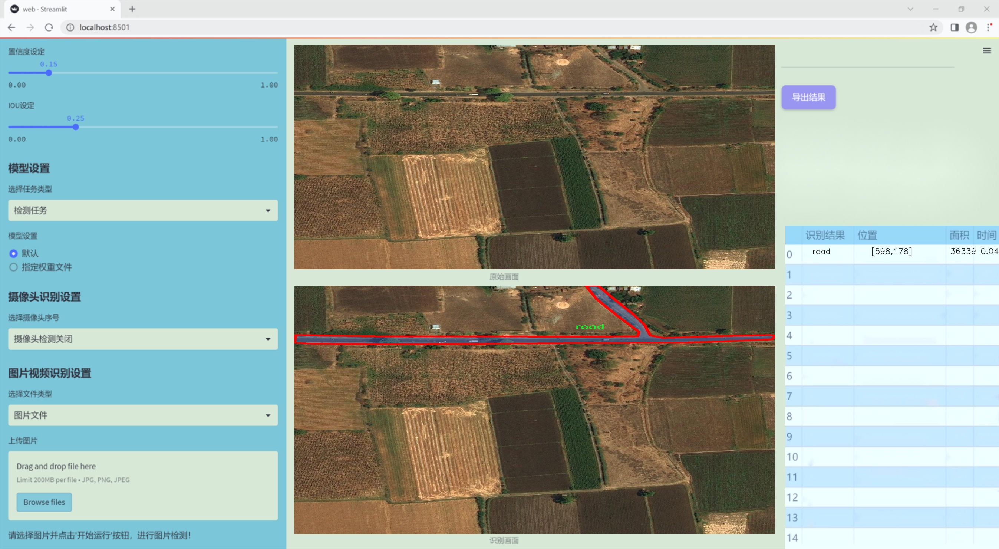
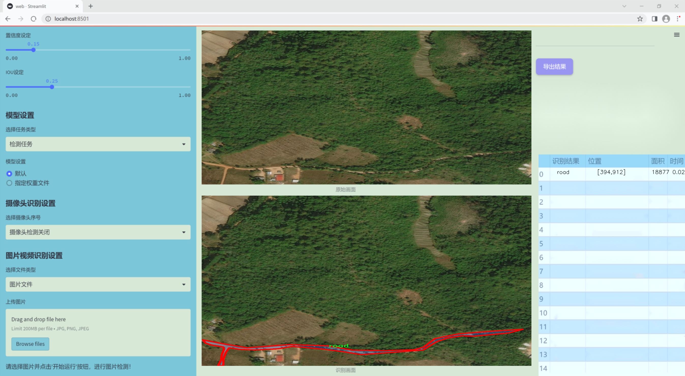
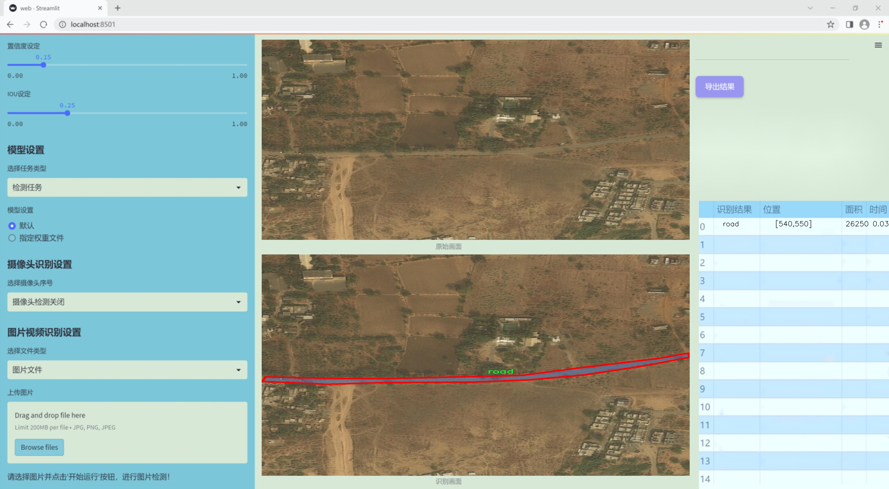
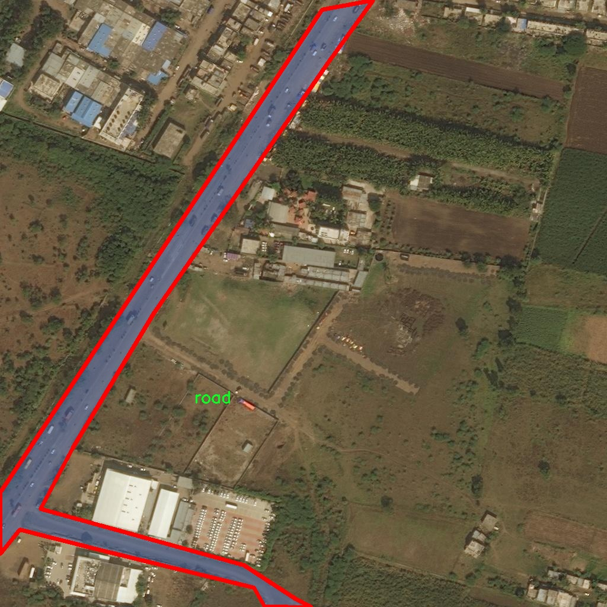
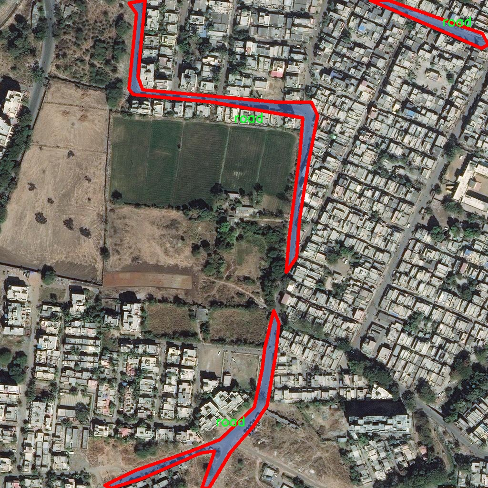
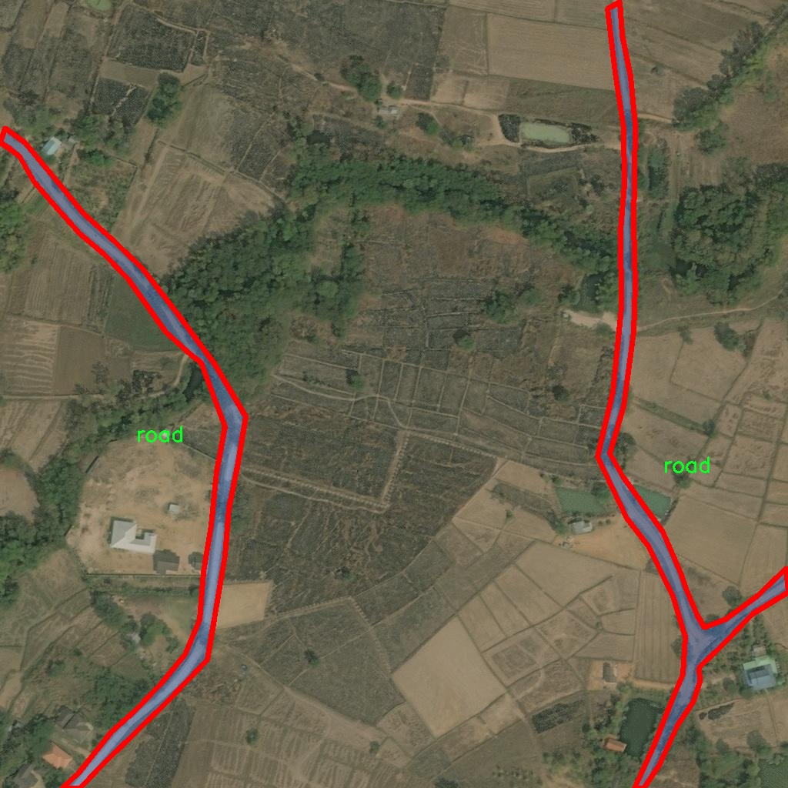

### 1.背景意义

研究背景与意义

随着城市化进程的加速，交通管理与道路监测的重要性日益凸显。遥感技术的快速发展为道路检测与分割提供了新的解决方案，尤其是在复杂环境下，传统的人工检测方法往往效率低下且容易出错。因此，基于遥感图像的自动化道路检测系统成为了研究的热点之一。近年来，深度学习技术的进步，尤其是目标检测算法的不断演化，使得计算机视觉在道路检测领域展现出强大的潜力。YOLO（You Only Look Once）系列算法因其高效性和实时性而备受关注，尤其是YOLOv11的推出，为解决遥感图像中的道路检测问题提供了新的思路。

本研究旨在基于改进的YOLOv11算法，构建一个高效的遥感图像道路检测分割系统。该系统将专注于识别和分割遥感图像中的道路信息，帮助相关部门进行交通规划、道路维护和安全监测。通过使用一个包含217幅图像的专用数据集，该数据集专注于道路这一单一类别，能够有效减少模型训练的复杂性，并提高检测精度。此外，数据集采用YOLOv8格式进行标注，确保了与现有深度学习框架的兼容性。

在实际应用中，准确的道路检测不仅能够提升交通管理的效率，还能为智能交通系统的构建提供基础数据支持。随着智能城市的不断发展，基于遥感图像的道路检测技术将成为未来交通管理的重要组成部分。因此，本研究的开展具有重要的理论价值和实际意义，能够为相关领域的研究提供新的思路和方法，同时推动遥感技术与深度学习的结合，为智能交通的实现奠定基础。

### 2.视频效果

[2.1 视频效果](https://www.bilibili.com/video/BV1XnU6YhEap/)

### 3.图片效果







##### [项目涉及的源码数据来源链接](https://kdocs.cn/l/cszuIiCKVNis)**

注意：本项目提供训练的数据集和训练教程,由于版本持续更新,暂不提供权重文件（best.pt）,请按照6.训练教程进行训练后实现上图演示的效果。

### 4.数据集信息

##### 4.1 本项目数据集类别数＆类别名

nc: 1
names: ['road']


该项目为【图像分割】数据集，请在【训练教程和Web端加载模型教程（第三步）】这一步的时候按照【图像分割】部分的教程来训练

##### 4.2 本项目数据集信息介绍

本项目数据集信息介绍

本项目所使用的数据集专注于遥感图像中的道路检测与分割，旨在为改进YOLOv11模型提供高质量的训练素材。数据集的主题为“road 2”，主要包含与道路相关的图像数据，旨在提升模型在复杂环境下的道路识别能力。该数据集的类别数量为1，具体类别为“road”，这意味着所有的标注均围绕道路的特征展开，确保模型能够专注于道路的检测与分割任务。

在数据集的构建过程中，特别注重图像的多样性与代表性，以涵盖不同地理环境、天气条件和光照变化下的道路特征。这种多样性不仅有助于提升模型的泛化能力，还能增强其在实际应用中的鲁棒性。数据集中的图像来源于多种遥感平台，涵盖城市、乡村、山区等多种场景，确保模型能够在不同的背景下有效识别道路。

此外，数据集中的每一幅图像均经过精细的标注，确保道路区域的准确性和完整性。这种高质量的标注为模型的训练提供了坚实的基础，使其能够学习到道路的形状、宽度及其与周围环境的关系。通过对这些数据的深入分析与学习，模型将能够更好地理解道路在不同场景中的表现，从而实现更为精准的检测与分割。

综上所述，本项目的数据集不仅为YOLOv11的改进提供了必要的训练素材，还通过其丰富的多样性和高质量的标注，助力于实现更高效的遥感图像道路检测与分割系统。









### 5.全套项目环境部署视频教程（零基础手把手教学）

[5.1 所需软件PyCharm和Anaconda安装教程（第一步）](https://www.bilibili.com/video/BV1BoC1YCEKi/?spm_id_from=333.999.0.0&vd_source=bc9aec86d164b67a7004b996143742dc)


[5.2 安装Python虚拟环境创建和依赖库安装视频教程（第二步）](https://www.bilibili.com/video/BV1ZoC1YCEBw?spm_id_from=333.788.videopod.sections&vd_source=bc9aec86d164b67a7004b996143742dc)

### 6.改进YOLOv11训练教程和Web_UI前端加载模型教程（零基础手把手教学）

[6.1 改进YOLOv11训练教程和Web_UI前端加载模型教程（第三步）](https://www.bilibili.com/video/BV1BoC1YCEhR?spm_id_from=333.788.videopod.sections&vd_source=bc9aec86d164b67a7004b996143742dc)


按照上面的训练视频教程链接加载项目提供的数据集，运行train.py即可开始训练



     Epoch   gpu_mem       box       obj       cls    labels  img_size
     1/200     20.8G   0.01576   0.01955  0.007536        22      1280: 100%|██████████| 849/849 [14:42<00:00,  1.04s/it]
               Class     Images     Labels          P          R     mAP@.5 mAP@.5:.95: 100%|██████████| 213/213 [01:14<00:00,  2.87it/s]
                 all       3395      17314      0.994      0.957      0.0957      0.0843

     Epoch   gpu_mem       box       obj       cls    labels  img_size
     2/200     20.8G   0.01578   0.01923  0.007006        22      1280: 100%|██████████| 849/849 [14:44<00:00,  1.04s/it]
               Class     Images     Labels          P          R     mAP@.5 mAP@.5:.95: 100%|██████████| 213/213 [01:12<00:00,  2.95it/s]
                 all       3395      17314      0.996      0.956      0.0957      0.0845

     Epoch   gpu_mem       box       obj       cls    labels  img_size
     3/200     20.8G   0.01561    0.0191  0.006895        27      1280: 100%|██████████| 849/849 [10:56<00:00,  1.29it/s]
               Class     Images     Labels          P          R     mAP@.5 mAP@.5:.95: 100%|███████   | 187/213 [00:52<00:00,  4.04it/s]
                 all       3395      17314      0.996      0.957      0.0957      0.0845


###### [项目数据集下载链接](https://kdocs.cn/l/cszuIiCKVNis)

### 7.原始YOLOv11算法讲解

YOLOv11是Ultralytics推出的YOLO系列最新版本，专为实现尖端的物体检测而设计。其架构和训练方法上进行了重大改进，使之不仅具备卓越的准确性和处理速度，还在计算效率上实现了一场革命。得益于其改进的主干和颈部架构，YOLOv11在特征提取和处理复杂任务时表现更加出色。在2024年9月27日，Ultralytics通过长达九小时的在线直播发布这一新作，展示了其在计算机视觉领域的革新。

YOLOv11通过精细的架构设计和优化训练流程，在保持高精度的同时，缩减了参数量，与YOLOv8m相比减少了22%的参数，使其在COCO数据集上的平均准确度（mAP）有所提升。这种效率的提高使YOLOv11非常适合部署在各种硬件环境中，包括边缘设备、云计算平台以及支持NVIDIA GPU的系统，确保在灵活性上的优势。

该模型支持广泛的任务，从对象检测、实例分割到图像分类、姿态估计和定向对象检测（OBB），几乎覆盖了计算机视觉的所有主要挑战。其创新的C3k2和C2PSA模块提升了网络深度和注意力机制的应用，提高了特征提取的效率和效果。同时，YOLOv11的改进网络结构也使之在复杂视觉任务上得以从容应对，成为各类计算机视觉任务的多功能选择。这些特性令YOLOv11在实施实时物体检测的各个领域中表现出众。
* * *

2024年9月27日，Ultralytics在线直播长达九小时，为YOLO11召开“发布会”

YOLO11 是 Ultralytics YOLO 系列实时物体检测器的最新版本，它以尖端的准确性、速度和效率重新定义了可能性。在之前 YOLO
版本的显著进步的基础上，YOLO11 在架构和训练方法方面进行了重大改进，使其成为各种计算机视觉任务的多功能选择。


##### YOLO11主要特点：

  * 增强的特征提取：YOLO11 采用了改进的主干和颈部架构，增强了特征提取能力，可实现更精确的对象检测和复杂任务性能。
  * 针对效率和速度进行了优化：YOLO11 引入了完善的架构设计和优化的训练流程，可提供更快的处理速度，并在准确度和性能之间保持最佳平衡。
  * 更少的参数，更高的准确度：借助模型设计的进步，YOLO11m 在 COCO 数据集上实现了更高的平均准确度 (mAP)，同时使用的参数比 YOLOv8m 少 22%，从而提高了计算效率，同时又不影响准确度。
  * 跨环境的适应性：YOLO11 可以无缝部署在各种环境中，包括边缘设备、云平台和支持 NVIDIA GPU 的系统，从而确保最大的灵活性。
  * 支持的任务范围广泛：无论是对象检测、实例分割、图像分类、姿势估计还是定向对象检测 (OBB)，YOLO11 都旨在满足各种计算机视觉挑战。

##### 支持的任务和模式

YOLO11 以 YOLOv8 中引入的多功能模型系列为基础，为各种计算机视觉任务提供增强的支持：

Model| Filenames| Task| Inference| Validation| Training| Export  
---|---|---|---|---|---|---  
YOLO11| yolol11n.pt, yolol11s.pt, yolol11m.pt, yolol11x.pt| Detection| ✅| ✅|
✅| ✅  
YOLO11-seg| yolol11n-seg.pt, yolol11s-seg.pt, yolol11m-seg.pt,
yolol11x-seg.pt| Instance Segmentation| ✅| ✅| ✅| ✅  
YOLO11-pose| yolol11n-pose.pt, yolol11s-pose.pt, yolol11m-pose.pt,
yolol11x-pose.pt| Pose/Keypoints| ✅| ✅| ✅| ✅  
YOLO11-obb| yolol11n-obb.pt, yolol11s-obb.pt, yolol11m-obb.pt,
yolol11x-obb.pt| Oriented Detection| ✅| ✅| ✅| ✅  
YOLO11-cls| yolol11n-cls.pt, yolol11s-cls.pt, yolol11m-cls.pt,
yolol11x-cls.pt| Classification| ✅| ✅| ✅| ✅  
  
##### 简单的 YOLO11 训练和推理示例

以下示例适用于用于对象检测的 YOLO11 Detect 模型。

    
    
    from ultralytics import YOLO
    
    # Load a model
    model = YOLO("yolo11n.pt")
    
    # Train the model
    train_results = model.train(
        data="coco8.yaml",  # path to dataset YAML
        epochs=100,  # number of training epochs
        imgsz=640,  # training image size
        device="cpu",  # device to run on, i.e. device=0 or device=0,1,2,3 or device=cpu
    )
    
    # Evaluate model performance on the validation set
    metrics = model.val()
    
    # Perform object detection on an image
    results = model("path/to/image.jpg")
    results[0].show()
    
    # Export the model to ONNX format
    path = model.export(format="onnx")  # return path to exported model

##### 支持部署于边缘设备

YOLO11 专为适应各种环境而设计，包括边缘设备。其优化的架构和高效的处理能力使其适合部署在边缘设备、云平台和支持 NVIDIA GPU
的系统上。这种灵活性确保 YOLO11 可用于各种应用，从移动设备上的实时检测到云环境中的复杂分割任务。有关部署选项的更多详细信息，请参阅导出文档。

##### YOLOv11 yaml文件

    
    
    # Ultralytics YOLO 🚀, AGPL-3.0 license
    # YOLO11 object detection model with P3-P5 outputs. For Usage examples see https://docs.ultralytics.com/tasks/detect
    
    # Parameters
    nc: 80 # number of classes
    scales: # model compound scaling constants, i.e. 'model=yolo11n.yaml' will call yolo11.yaml with scale 'n'
      # [depth, width, max_channels]
      n: [0.50, 0.25, 1024] # summary: 319 layers, 2624080 parameters, 2624064 gradients, 6.6 GFLOPs
      s: [0.50, 0.50, 1024] # summary: 319 layers, 9458752 parameters, 9458736 gradients, 21.7 GFLOPs
      m: [0.50, 1.00, 512] # summary: 409 layers, 20114688 parameters, 20114672 gradients, 68.5 GFLOPs
      l: [1.00, 1.00, 512] # summary: 631 layers, 25372160 parameters, 25372144 gradients, 87.6 GFLOPs
      x: [1.00, 1.50, 512] # summary: 631 layers, 56966176 parameters, 56966160 gradients, 196.0 GFLOPs
    
    # YOLO11n backbone
    backbone:
      # [from, repeats, module, args]
      - [-1, 1, Conv, [64, 3, 2]] # 0-P1/2
      - [-1, 1, Conv, [128, 3, 2]] # 1-P2/4
      - [-1, 2, C3k2, [256, False, 0.25]]
      - [-1, 1, Conv, [256, 3, 2]] # 3-P3/8
      - [-1, 2, C3k2, [512, False, 0.25]]
      - [-1, 1, Conv, [512, 3, 2]] # 5-P4/16
      - [-1, 2, C3k2, [512, True]]
      - [-1, 1, Conv, [1024, 3, 2]] # 7-P5/32
      - [-1, 2, C3k2, [1024, True]]
      - [-1, 1, SPPF, [1024, 5]] # 9
      - [-1, 2, C2PSA, [1024]] # 10
    
    # YOLO11n head
    head:
      - [-1, 1, nn.Upsample, [None, 2, "nearest"]]
      - [[-1, 6], 1, Concat, [1]] # cat backbone P4
      - [-1, 2, C3k2, [512, False]] # 13
    
      - [-1, 1, nn.Upsample, [None, 2, "nearest"]]
      - [[-1, 4], 1, Concat, [1]] # cat backbone P3
      - [-1, 2, C3k2, [256, False]] # 16 (P3/8-small)
    
      - [-1, 1, Conv, [256, 3, 2]]
      - [[-1, 13], 1, Concat, [1]] # cat head P4
      - [-1, 2, C3k2, [512, False]] # 19 (P4/16-medium)
    
      - [-1, 1, Conv, [512, 3, 2]]
      - [[-1, 10], 1, Concat, [1]] # cat head P5
      - [-1, 2, C3k2, [1024, True]] # 22 (P5/32-large)
    
      - [[16, 19, 22], 1, Detect, [nc]] # Detect(P3, P4, P5)
    

**YOLO11和YOLOv8 yaml文件的区别**


##### 改进模块代码

  * C3k2 

    
    
    class C3k2(C2f):
        """Faster Implementation of CSP Bottleneck with 2 convolutions."""
    
        def __init__(self, c1, c2, n=1, c3k=False, e=0.5, g=1, shortcut=True):
            """Initializes the C3k2 module, a faster CSP Bottleneck with 2 convolutions and optional C3k blocks."""
            super().__init__(c1, c2, n, shortcut, g, e)
            self.m = nn.ModuleList(
                C3k(self.c, self.c, 2, shortcut, g) if c3k else Bottleneck(self.c, self.c, shortcut, g) for _ in range(n)
            )

C3k2，它是具有两个卷积的CSP（Partial Cross Stage）瓶颈架构的更快实现。

**类继承：**

  * `C3k2`继承自类`C2f`。这表明`C2f`很可能实现了经过修改的基本CSP结构，而`C3k2`进一步优化或修改了此结构。

**构造函数（`__init__`）：**

  * `c1`：输入通道。

  * `c2`：输出通道。

  * `n`：瓶颈层数（默认为1）。

  * `c3k`：一个布尔标志，确定是否使用`C3k`块或常规`Bottleneck`块。

  * `e`：扩展比率，控制隐藏层的宽度（默认为0.5）。

  * `g`：分组卷积的组归一化参数或组数（默认值为 1）。

  * `shortcut`：一个布尔值，用于确定是否在网络中包含快捷方式连接（默认值为 `True`）。

**初始化：**

  * `super().__init__(c1, c2, n, short-cut, g, e)` 调用父类 `C2f` 的构造函数，初始化标准 CSP 组件，如通道数、快捷方式、组等。

**模块列表（`self.m`）：**

  * `nn.ModuleList` 存储 `C3k` 或 `Bottleneck` 模块，具体取决于 `c3k` 的值。

  * 如果 `c3k` 为 `True`，它会初始化 `C3k` 模块。`C3k` 模块接收以下参数：

  * `self.c`：通道数（源自 `C2f`）。

  * `2`：这表示在 `C3k` 块内使用了两个卷积层。

  * `shortcut` 和 `g`：从 `C3k2` 构造函数传递。

  * 如果 `c3k` 为 `False`，则初始化标准 `Bottleneck` 模块。

`for _ in range(n)` 表示将创建 `n` 个这样的块。

**总结：**

  * `C3k2` 实现了 CSP 瓶颈架构，可以选择使用自定义 `C3k` 块（具有两个卷积）或标准 `Bottleneck` 块，具体取决于 `c3k` 标志。

  * C2PSA

    
    
    class C2PSA(nn.Module):
        """
        C2PSA module with attention mechanism for enhanced feature extraction and processing.
    
        This module implements a convolutional block with attention mechanisms to enhance feature extraction and processing
        capabilities. It includes a series of PSABlock modules for self-attention and feed-forward operations.
    
        Attributes:
            c (int): Number of hidden channels.
            cv1 (Conv): 1x1 convolution layer to reduce the number of input channels to 2*c.
            cv2 (Conv): 1x1 convolution layer to reduce the number of output channels to c.
            m (nn.Sequential): Sequential container of PSABlock modules for attention and feed-forward operations.
    
        Methods:
            forward: Performs a forward pass through the C2PSA module, applying attention and feed-forward operations.
    
        Notes:
            This module essentially is the same as PSA module, but refactored to allow stacking more PSABlock modules.
    
        Examples:
            >>> c2psa = C2PSA(c1=256, c2=256, n=3, e=0.5)
            >>> input_tensor = torch.randn(1, 256, 64, 64)
            >>> output_tensor = c2psa(input_tensor)
        """
    
        def __init__(self, c1, c2, n=1, e=0.5):
            """Initializes the C2PSA module with specified input/output channels, number of layers, and expansion ratio."""
            super().__init__()
            assert c1 == c2
            self.c = int(c1 * e)
            self.cv1 = Conv(c1, 2 * self.c, 1, 1)
            self.cv2 = Conv(2 * self.c, c1, 1)
    
            self.m = nn.Sequential(*(PSABlock(self.c, attn_ratio=0.5, num_heads=self.c // 64) for _ in range(n)))
    
        def forward(self, x):
            """Processes the input tensor 'x' through a series of PSA blocks and returns the transformed tensor."""
            a, b = self.cv1(x).split((self.c, self.c), dim=1)
            b = self.m(b)
            return self.cv2(torch.cat((a, b), 1))

`C2PSA` 模块是一个自定义神经网络层，带有注意力机制，用于增强特征提取和处理。

**类概述**

  * **目的：**

  * `C2PSA` 模块引入了一个卷积块，利用注意力机制来改进特征提取和处理。

  * 它使用一系列 `PSABlock` 模块，这些模块可能代表某种形式的位置自注意力 (PSA)，并且该架构旨在允许堆叠多个 `PSABlock` 层。

**构造函数（`__init__`）：**

  * **参数：**

  * `c1`：输入通道（必须等于 `c2`）。

  * `c2`：输出通道（必须等于 `c1`）。

  * `n`：要堆叠的 `PSABlock` 模块数量（默认值为 1）。

  * `e`：扩展比率，用于计算隐藏通道的数量（默认值为 0.5）。

  * **属性：**

  * `self.c`：隐藏通道数，计算为 `int(c1 * e)`。

  * `self.cv1`：一个 `1x1` 卷积，将输入通道数从 `c1` 减少到 `2 * self.c`。这为将输入分成两部分做好准备。

  * `self.cv2`：另一个 `1x1` 卷积，处理后将通道维度恢复回 `c1`。

  * `self.m`：一系列 `PSABlock` 模块。每个 `PSABlock` 接收 `self.c` 通道，注意头的数量为 `self.c // 64`。每个块应用注意和前馈操作。

**前向方法：**

  * **输入：**

  * `x`，输入张量。

  * **操作：**

  1. `self.cv1(x)` 应用 `1x1` 卷积，将输入通道大小从 `c1` 减小到 `2 * self.c`。

  2. 生成的张量沿通道维度分为两部分，`a` 和 `b`。

  * `a`：第一个 `self.c` 通道。

  * `b`：剩余的 `self.c` 通道。

  1. `b` 通过顺序容器 `self.m`，它是 `PSABlock` 模块的堆栈。这部分经过基于注意的处理。

  2. 处理后的张量 `b` 与 `a` 连接。

  3. `self.cv2` 应用 `1x1` 卷积，将通道大小恢复为 `c1`。

  * **输出：**

  * 应用注意和卷积操作后的变换后的张量。

**总结：**

  * **C2PSA** 是一个增强型卷积模块，它通过堆叠的 `PSABlock` 模块应用位置自注意力。它拆分输入张量，将注意力应用于其中一部分，然后重新组合并通过最终卷积对其进行处理。此结构有助于从输入数据中提取复杂特征。

##### 网络结构


### 8.200+种全套改进YOLOV11创新点原理讲解

#### 8.1 200+种全套改进YOLOV11创新点原理讲解大全

由于篇幅限制，每个创新点的具体原理讲解就不全部展开，具体见下列网址中的改进模块对应项目的技术原理博客网址【Blog】（创新点均为模块化搭建，原理适配YOLOv5~YOLOv11等各种版本）

[改进模块技术原理博客【Blog】网址链接](https://gitee.com/qunmasj/good)


#### 8.2 精选部分改进YOLOV11创新点原理讲解

###### 这里节选部分改进创新点展开原理讲解(完整的改进原理见上图和[改进模块技术原理博客链接](https://gitee.com/qunmasj/good)【如果此小节的图加载失败可以通过CSDN或者Github搜索该博客的标题访问原始博客，原始博客图片显示正常】

### MS-Block简介
实时目标检测，以YOLO系列为例，已在工业领域中找到重要应用，特别是在边缘设备（如无人机和机器人）中。与之前的目标检测器不同，实时目标检测器旨在在速度和准确性之间追求最佳平衡。为了实现这一目标，提出了大量的工作：从第一代DarkNet到CSPNet，再到最近的扩展ELAN，随着性能的快速增长，实时目标检测器的架构经历了巨大的变化。

尽管性能令人印象深刻，但在不同尺度上识别对象仍然是实时目标检测器面临的基本挑战。这促使作者设计了一个强大的编码器架构，用于学习具有表现力的多尺度特征表示。具体而言，作者从两个新的角度考虑为实时目标检测编码多尺度特征：

从局部视角出发，作者设计了一个具有简单而有效的分层特征融合策略的MS-Block。受到Res2Net的启发，作者在MS-Block中引入了多个分支来进行特征提取，但不同的是，作者使用了一个带有深度卷积的 Inverted Bottleneck Block块，以实现对大Kernel的高效利用。

从全局视角出发，作者提出随着网络加深逐渐增加卷积的Kernel-Size。作者在浅层使用小Kernel卷积来更高效地处理高分辨率特征。另一方面，在深层中，作者采用大Kernel卷积来捕捉广泛的信息。

基于以上设计原则，作者呈现了作者的实时目标检测器，称为YOLO-MS。为了评估作者的YOLO-MS的性能，作者在MS COCO数据集上进行了全面的实验。还提供了与其他最先进方法的定量比较，以展示作者方法的强大性能。如图1所示，YOLO-MS在计算性能平衡方面优于其他近期的实时目标检测器。


具体而言，YOLO-MS-XS在MS COCO上获得了43%+的AP得分，仅具有450万个可学习参数和8.7亿个FLOPs。YOLO-MS-S和YOLO-MS分别获得了46%+和51%+的AP，可学习参数分别为810万和2220万。此外，作者的工作还可以作为其他YOLO模型的即插即用模块。通常情况下，作者的方法可以将YOLOv11的AP从37%+显著提高到40%+，甚至还可以使用更少的参数和FLOPs。

CSP Block是一个基于阶段级梯度路径的网络，平衡了梯度组合和计算成本。它是广泛应用于YOLO系列的基本构建块。已经提出了几种变体，包括YOLOv4和YOLOv11中的原始版本，Scaled YOLOv4中的CSPVoVNet，YOLOv11中的ELAN，以及RTMDet中提出的大Kernel单元。作者在图2(a)和图2(b)中分别展示了原始CSP块和ELAN的结构。


上述实时检测器中被忽视的一个关键方面是如何在基本构建块中编码多尺度特征。其中一个强大的设计原则是Res2Net，它聚合了来自不同层次的特征以增强多尺度表示。然而，这一原则并没有充分探索大Kernel卷积的作用，而大Kernel卷积已经在基于CNN的视觉识别任务模型中证明有效。将大Kernel卷积纳入Res2Net的主要障碍在于它们引入的计算开销，因为构建块采用了标准卷积。在作者的方法中，作者提出用 Inverted Bottleneck Block替代标准的3 × 3卷积，以享受大Kernel卷积的好处。

#### MS-Block

基于前面的分析，参考该博客提出了一个带有分层特征融合策略的全新Block，称为MS-Block，以增强实时目标检测器在提取多尺度特征时的能力，同时保持快速的推理速度。

MS-Block的具体结构如图2(c)所示。假设是输入特征。通过1×1卷积的转换后，X的通道维度增加到n*C。然后，作者将X分割成n个不同的组，表示为，其中。为了降低计算成本，作者选择n为3。

注意，除了之外，每个其他组都经过一个 Inverted Bottleneck Block层，用表示，其中k表示Kernel-Size，以获得。的数学表示如下：


根据这个公式，作者不将 Inverted Bottleneck Block层连接到，使其作为跨阶段连接，并保留来自前面层的信息。最后，作者将所有分割连接在一起，并应用1×1卷积来在所有分割之间进行交互，每个分割都编码不同尺度的特征。当网络加深时，这个1×1卷积也用于调整通道数。

#### Heterogeneous Kernel Selection Protocol
除了构建块的设计外，作者还从宏观角度探讨了卷积的使用。之前的实时目标检测器在不同的编码器阶段采用了同质卷积（即具有相同Kernel-Size的卷积），但作者认为这不是提取多尺度语义信息的最佳选项。

在金字塔结构中，从检测器的浅阶段提取的高分辨率特征通常用于捕捉细粒度语义，将用于检测小目标。相反，来自网络较深阶段的低分辨率特征用于捕捉高级语义，将用于检测大目标。如果作者在所有阶段都采用统一的小Kernel卷积，深阶段的有效感受野（ERF）将受到限制，影响大目标的性能。在每个阶段中引入大Kernel卷积可以帮助解决这个问题。然而，具有大的ERF的大Kernel可以编码更广泛的区域，这增加了在小目标外部包含噪声信息的概率，并且降低了推理速度。

在这项工作中，作者建议在不同阶段中采用异构卷积，以帮助捕获更丰富的多尺度特征。具体来说，在编码器的第一个阶段中，作者采用最小Kernel卷积，而最大Kernel卷积位于最后一个阶段。随后，作者逐步增加中间阶段的Kernel-Size，使其与特征分辨率的增加保持一致。这种策略允许提取细粒度和粗粒度的语义信息，增强了编码器的多尺度特征表示能力。

正如图所示，作者将k的值分别分配给编码器中的浅阶段到深阶段，取值为3、5、7和9。作者将其称为异构Kernel选择（HKS）协议。


作者的HKS协议能够在深层中扩大感受野，而不会对浅层产生任何其他影响。第4节的图4支持了作者的分析。此外，HKS不仅有助于编码更丰富的多尺度特征，还确保了高效的推理。

如表1所示，将大Kernel卷积应用于高分辨率特征会产生较高的计算开销。然而，作者的HKS协议在低分辨率特征上采用大Kernel卷积，从而与仅使用大Kernel卷积相比，大大降低了计算成本。


在实践中，作者经验性地发现，采用HKS协议的YOLO-MS的推理速度几乎与仅使用深度可分离的3 × 3卷积相同。


如图所示，作者模型的Backbone由4个阶段组成，每个阶段后面跟随1个步长为2的3 × 3卷积进行下采样。在第3个阶段后，作者添加了1个SPP块，与RTMDet中一样。在作者的编码器上，作者使用PAFPN作为Neck来构建特征金字塔[31, 35]。它融合了从Backbone不同阶段提取的多尺度特征。Neck中使用的基本构建块也是作者的MS-Block，在其中使用3 × 3深度可分离卷积进行快速推理。

此外，为了在速度和准确性之间取得更好的平衡，作者将Backbone中多级特征的通道深度减半。作者提供了3个不同尺度的YOLO-MS变体，即YOLO-MS-XS、YOLO-MS-S和YOLO-MS。不同尺度的YOLO-MS的详细配置列在表2中。对于YOLO-MS的其他部分，作者将其保持与RTMDet相同。


### 9.系统功能展示

图9.1.系统支持检测结果表格显示

  图9.2.系统支持置信度和IOU阈值手动调节

  图9.3.系统支持自定义加载权重文件best.pt(需要你通过步骤5中训练获得)

  图9.4.系统支持摄像头实时识别

  图9.5.系统支持图片识别

  图9.6.系统支持视频识别

  图9.7.系统支持识别结果文件自动保存

  图9.8.系统支持Excel导出检测结果数据


### 10. YOLOv11核心改进源码讲解

#### 10.1 dynamic_snake_conv.py

以下是对代码的核心部分进行分析和详细注释的结果：

```python
import torch
import torch.nn as nn
from ..modules.conv import Conv

__all__ = ['DySnakeConv']

class DySnakeConv(nn.Module):
    def __init__(self, inc, ouc, k=3) -> None:
        super().__init__()
        
        # 初始化三个卷积层
        self.conv_0 = Conv(inc, ouc, k)  # 标准卷积
        self.conv_x = DSConv(inc, ouc, 0, k)  # 沿x轴的动态蛇形卷积
        self.conv_y = DSConv(inc, ouc, 1, k)  # 沿y轴的动态蛇形卷积
    
    def forward(self, x):
        # 前向传播，连接三个卷积的输出
        return torch.cat([self.conv_0(x), self.conv_x(x), self.conv_y(x)], dim=1)

class DSConv(nn.Module):
    def __init__(self, in_ch, out_ch, morph, kernel_size=3, if_offset=True, extend_scope=1):
        """
        动态蛇形卷积
        :param in_ch: 输入通道数
        :param out_ch: 输出通道数
        :param kernel_size: 卷积核大小
        :param extend_scope: 扩展范围（默认1）
        :param morph: 卷积核的形态，分为沿x轴（0）和y轴（1）
        :param if_offset: 是否需要变形，False为标准卷积
        """
        super(DSConv, self).__init__()
        # 用于学习可变形偏移的卷积层
        self.offset_conv = nn.Conv2d(in_ch, 2 * kernel_size, 3, padding=1)
        self.bn = nn.BatchNorm2d(2 * kernel_size)  # 批归一化
        self.kernel_size = kernel_size

        # 定义沿x轴和y轴的动态蛇形卷积
        self.dsc_conv_x = nn.Conv2d(
            in_ch,
            out_ch,
            kernel_size=(kernel_size, 1),
            stride=(kernel_size, 1),
            padding=0,
        )
        self.dsc_conv_y = nn.Conv2d(
            in_ch,
            out_ch,
            kernel_size=(1, kernel_size),
            stride=(1, kernel_size),
            padding=0,
        )

        self.gn = nn.GroupNorm(out_ch // 4, out_ch)  # 组归一化
        self.act = Conv.default_act  # 默认激活函数

        self.extend_scope = extend_scope
        self.morph = morph
        self.if_offset = if_offset

    def forward(self, f):
        # 前向传播
        offset = self.offset_conv(f)  # 计算偏移
        offset = self.bn(offset)  # 批归一化
        offset = torch.tanh(offset)  # 将偏移限制在[-1, 1]
        
        # 获取输入特征的形状
        input_shape = f.shape
        dsc = DSC(input_shape, self.kernel_size, self.extend_scope, self.morph)  # 创建DSC对象
        deformed_feature = dsc.deform_conv(f, offset, self.if_offset)  # 进行可变形卷积
        
        # 根据形态选择相应的卷积操作
        if self.morph == 0:
            x = self.dsc_conv_x(deformed_feature.type(f.dtype))
        else:
            x = self.dsc_conv_y(deformed_feature.type(f.dtype))
        
        x = self.gn(x)  # 组归一化
        x = self.act(x)  # 激活函数
        return x

# 动态蛇形卷积的核心部分
class DSC(object):
    def __init__(self, input_shape, kernel_size, extend_scope, morph):
        self.num_points = kernel_size  # 卷积核的点数
        self.width = input_shape[2]  # 输入特征图的宽度
        self.height = input_shape[3]  # 输入特征图的高度
        self.morph = morph  # 卷积核形态
        self.extend_scope = extend_scope  # 偏移范围

        # 定义特征图的形状
        self.num_batch = input_shape[0]  # 批量大小
        self.num_channels = input_shape[1]  # 通道数

    def _coordinate_map_3D(self, offset, if_offset):
        # 计算3D坐标图
        device = offset.device
        y_offset, x_offset = torch.split(offset, self.num_points, dim=1)  # 分离y和x的偏移

        # 生成y和x的中心坐标
        y_center = torch.arange(0, self.width).repeat([self.height]).reshape(self.height, self.width).permute(1, 0).reshape([-1, self.width, self.height]).unsqueeze(0)
        x_center = torch.arange(0, self.height).repeat([self.width]).reshape(self.width, self.height).permute(0, 1).reshape([-1, self.width, self.height]).unsqueeze(0)

        # 根据形态初始化卷积核
        if self.morph == 0:
            y = torch.linspace(0, 0, 1)
            x = torch.linspace(-int(self.num_points // 2), int(self.num_points // 2), int(self.num_points))
        else:
            y = torch.linspace(-int(self.num_points // 2), int(self.num_points // 2), int(self.num_points))
            x = torch.linspace(0, 0, 1)

        y, x = torch.meshgrid(y, x)  # 生成网格
        y_spread = y.reshape(-1, 1)
        x_spread = x.reshape(-1, 1)

        # 生成新的y和x坐标
        y_grid = y_spread.repeat([1, self.width * self.height]).reshape([self.num_points, self.width, self.height]).unsqueeze(0)
        x_grid = x_spread.repeat([1, self.width * self.height]).reshape([self.num_points, self.width, self.height]).unsqueeze(0)

        y_new = y_center + y_grid
        x_new = x_center + x_grid

        # 处理偏移
        if if_offset:
            y_offset_new = y_offset.detach().clone()
            center = int(self.num_points // 2)
            y_offset_new[center] = 0
            for index in range(1, center):
                y_offset_new[center + index] = (y_offset_new[center + index - 1] + y_offset[center + index])
                y_offset_new[center - index] = (y_offset_new[center - index + 1] + y_offset[center - index])
            y_new = y_new.add(y_offset_new.mul(self.extend_scope))

        # 返回新的y和x坐标
        return y_new.reshape([self.num_batch, self.num_points, 1, self.width, self.height]).permute(0, 3, 1, 4, 2), x_new.reshape([self.num_batch, self.num_points, 1, self.width, self.height]).permute(0, 3, 1, 4, 2)

    def _bilinear_interpolate_3D(self, input_feature, y, x):
        # 进行3D双线性插值
        device = input_feature.device
        y = y.reshape([-1]).float()
        x = x.reshape([-1]).float()

        # 计算插值所需的坐标
        y0 = torch.floor(y).int()
        y1 = y0 + 1
        x0 = torch.floor(x).int()
        x1 = x0 + 1

        # 限制坐标范围
        max_y = self.width - 1
        max_x = self.height - 1
        y0 = torch.clamp(y0, 0, max_y)
        y1 = torch.clamp(y1, 0, max_y)
        x0 = torch.clamp(x0, 0, max_x)
        x1 = torch.clamp(x1, 0, max_x)

        # 获取8个网格值
        input_feature_flat = input_feature.flatten().reshape(self.num_batch, self.num_channels, self.width, self.height).permute(0, 2, 3, 1).reshape(-1, self.num_channels)
        dimension = self.height * self.width
        base = torch.arange(self.num_batch) * dimension
        base = base.reshape([-1, 1]).float()

        # 计算插值
        base_y0 = base + y0 * self.height
        base_y1 = base + y1 * self.height
        index_a0 = base_y0 - base + x0
        index_c0 = base_y0 - base + x1
        index_a1 = base_y1 - base + x0
        index_c1 = base_y1 - base + x1

        # 获取8个网格值
        value_a0 = input_feature_flat[index_a0.type(torch.int64)].to(device)
        value_c0 = input_feature_flat[index_c0.type(torch.int64)].to(device)
        value_a1 = input_feature_flat[index_a1.type(torch.int64)].to(device)
        value_c1 = input_feature_flat[index_c1.type(torch.int64)].to(device)

        # 计算最终输出
        outputs = (value_a0 * ((y1.float() - y) * (x1.float() - x).unsqueeze(-1).to(device)) +
                   value_c0 * ((y1.float() - y) * (x - x0.float()).unsqueeze(-1).to(device)) +
                   value_a1 * ((y - y0.float()) * (x1.float() - x).unsqueeze(-1).to(device)) +
                   value_c1 * ((y - y0.float()) * (x - x0.float()).unsqueeze(-1).to(device)))

        # 根据形态调整输出形状
        if self.morph == 0:
            outputs = outputs.reshape([self.num_batch, self.num_points * self.width, 1 * self.height, self.num_channels]).permute(0, 3, 1, 2)
        else:
            outputs = outputs.reshape([self.num_batch, 1 * self.width, self.num_points * self.height, self.num_channels]).permute(0, 3, 1, 2)
        return outputs

    def deform_conv(self, input, offset, if_offset):
        # 进行可变形卷积
        y, x = self._coordinate_map_3D(offset, if_offset)  # 计算坐标图
        deformed_feature = self._bilinear_interpolate_3D(input, y, x)  # 进行插值
        return deformed_feature  # 返回变形后的特征图
```

### 代码核心部分分析
1. **DySnakeConv** 类是动态蛇形卷积的主要模块，包含三个卷积层：标准卷积和两个动态蛇形卷积（分别沿x轴和y轴）。
2. **DSConv** 类实现了动态蛇形卷积的具体逻辑，包括偏移学习、坐标计算和双线性插值。
3. **DSC** 类负责生成3D坐标图和执行双线性插值，完成输入特征图的变形处理。

### 关键功能
- **动态卷积**：通过学习偏移量来实现特征图的动态变形。
- **双线性插值**：在变形过程中，通过双线性插值方法来获取新的特征图值。
- **灵活性**：可以根据不同的卷积核形态（x轴或y轴）来选择相应的卷积操作。

这个文件定义了一个动态蛇形卷积（Dynamic Snake Convolution）模块，主要由两个类构成：`DySnakeConv` 和 `DSConv`，以及一个辅助类 `DSC`。这些类结合了标准卷积和可变形卷积的思想，旨在通过动态调整卷积核的位置来提高特征提取的能力。

首先，`DySnakeConv` 类是一个神经网络模块，继承自 `nn.Module`。在其构造函数中，初始化了三个卷积层：`conv_0` 是一个标准卷积，`conv_x` 和 `conv_y` 是动态蛇形卷积，分别沿着 x 轴和 y 轴进行操作。`forward` 方法将输入数据 `x` 通过这三个卷积层处理后，将结果在通道维度上拼接起来，形成一个更丰富的特征表示。

接下来，`DSConv` 类实现了动态蛇形卷积的具体逻辑。构造函数中，定义了多个卷积层和参数，包括用于学习偏移量的卷积层 `offset_conv`，以及两个方向的卷积层 `dsc_conv_x` 和 `dsc_conv_y`。此外，还包括批归一化层和激活函数。`forward` 方法中，首先通过 `offset_conv` 计算出偏移量，然后使用 `DSC` 类生成的坐标图来进行可变形卷积操作，最后根据不同的形态（x 轴或 y 轴）返回处理后的特征。

`DSC` 类是一个辅助类，负责生成坐标图和进行双线性插值。它的构造函数接收输入形状、卷积核大小、扩展范围和形态参数。`_coordinate_map_3D` 方法根据偏移量生成新的坐标图，`_bilinear_interpolate_3D` 方法则根据生成的坐标图对输入特征进行双线性插值，得到变形后的特征图。`deform_conv` 方法是对外接口，调用前面的两个方法，完成从输入特征到变形特征的转换。

总体而言，这个文件实现了一个灵活的卷积模块，通过动态调整卷积核的位置来适应输入特征的形状，从而提高了卷积神经网络在处理复杂数据时的表现。

#### 10.2 UniRepLKNet.py

以下是经过简化并添加详细中文注释的核心代码部分：

```python
import torch
import torch.nn as nn
import torch.nn.functional as F

class GRNwithNHWC(nn.Module):
    """ 
    GRN (Global Response Normalization) 层
    该层用于对输入进行全局响应归一化，假设输入格式为 (N, H, W, C)
    """
    def __init__(self, dim, use_bias=True):
        super().__init__()
        self.use_bias = use_bias
        # gamma 和 beta 是可学习的参数
        self.gamma = nn.Parameter(torch.zeros(1, 1, 1, dim))
        if self.use_bias:
            self.beta = nn.Parameter(torch.zeros(1, 1, 1, dim))

    def forward(self, x):
        # 计算输入的 L2 范数
        Gx = torch.norm(x, p=2, dim=(1, 2), keepdim=True)
        # 计算归一化因子
        Nx = Gx / (Gx.mean(dim=-1, keepdim=True) + 1e-6)
        if self.use_bias:
            return (self.gamma * Nx + 1) * x + self.beta
        else:
            return (self.gamma * Nx + 1) * x

class UniRepLKNetBlock(nn.Module):
    """
    UniRepLKNet 的基本模块
    包含深度卷积、归一化、激活函数和 Squeeze-and-Excitation (SE) 块
    """
    def __init__(self, dim, kernel_size, drop_path=0., deploy=False):
        super().__init__()
        # 深度卷积层
        self.dwconv = nn.Conv2d(dim, dim, kernel_size=kernel_size, stride=1, padding=kernel_size // 2, groups=dim)
        # 归一化层
        self.norm = nn.BatchNorm2d(dim)
        # Squeeze-and-Excitation 块
        self.se = SEBlock(dim, dim // 4)
        # 前馈网络
        self.pwconv1 = nn.Linear(dim, dim * 4)
        self.pwconv2 = nn.Linear(dim * 4, dim)

    def forward(self, x):
        # 深度卷积 + 归一化 + SE 块
        y = self.se(self.norm(self.dwconv(x)))
        # 前馈网络
        y = self.pwconv2(F.gelu(self.pwconv1(y)))
        return y + x  # 残差连接

class UniRepLKNet(nn.Module):
    """
    UniRepLKNet 模型
    包含多个 UniRepLKNetBlock 组成的阶段
    """
    def __init__(self, in_chans=3, num_classes=1000, depths=(3, 3, 27, 3), dims=(96, 192, 384, 768)):
        super().__init__()
        self.stages = nn.ModuleList()
        for i in range(len(depths)):
            # 每个阶段包含多个 UniRepLKNetBlock
            stage = nn.Sequential(*[UniRepLKNetBlock(dim=dims[i], kernel_size=3) for _ in range(depths[i])])
            self.stages.append(stage)

    def forward(self, x):
        for stage in self.stages:
            x = stage(x)  # 逐阶段前向传播
        return x

# 创建模型实例并进行前向传播
if __name__ == '__main__':
    inputs = torch.randn((1, 3, 640, 640))  # 随机输入
    model = UniRepLKNet()  # 实例化模型
    res = model(inputs)  # 前向传播
    print(res.shape)  # 输出结果的形状
```

### 代码说明：
1. **GRNwithNHWC**: 实现了全局响应归一化层，用于调整输入特征的响应。
2. **UniRepLKNetBlock**: 定义了模型的基本构建块，包含深度卷积、归一化、激活函数和 Squeeze-and-Excitation 块，使用残差连接来增强信息流动。
3. **UniRepLKNet**: 整个模型由多个 `UniRepLKNetBlock` 组成，按照给定的深度和维度进行堆叠，形成不同的阶段。
4. **主程序**: 创建模型实例并对随机输入进行前向传播，输出结果的形状。

这个程序文件 `UniRepLKNet.py` 实现了一个名为 UniRepLKNet 的深度学习模型，主要用于音频、视频、点云、时间序列和图像识别。该模型基于多个现有的深度学习框架和方法，包括 RepLKNet、ConvNeXt、timm、DINO 和 DeiT。文件中包含了多个类和函数，构成了模型的核心结构。

首先，文件导入了必要的库，包括 PyTorch 及其相关模块。接着，定义了一些基础组件，如 GRN（全局响应归一化）层、NCHW 和 NHWC 格式的转换层。这些组件在模型的不同部分中被重复使用，以提高代码的可读性和复用性。

`get_conv2d` 函数用于根据输入参数决定使用哪种卷积实现，支持原生卷积和高效的 iGEMM 大核卷积实现。`get_bn` 函数则根据是否使用同步批归一化返回相应的批归一化层。

接下来，定义了 Squeeze-and-Excitation Block（SEBlock），它通过自适应平均池化和两个卷积层来调整通道的权重，从而增强模型的表达能力。还有一些函数用于合并卷积层的批归一化参数，以及将膨胀卷积转换为非膨胀卷积。

`DilatedReparamBlock` 类实现了膨胀重参数化块，允许在不同的卷积核大小和膨胀率下进行卷积操作。这个类的设计使得模型在推理时能够高效地使用大核卷积。

`UniRepLKNetBlock` 类是模型的基本构建块，包含了卷积层、归一化层、SEBlock 和前馈网络。它支持不同的配置，如是否启用随机深度、是否使用层缩放等。

`UniRepLKNet` 类则是整个模型的主体，负责构建不同的层和块，并定义前向传播的逻辑。模型的初始化参数包括输入通道数、类别数、每个阶段的深度和特征维度等。模型支持多种输出模式，如返回特征或分类结果。

最后，文件提供了一些函数，用于创建不同配置的 UniRepLKNet 模型实例，并加载预训练权重。主程序部分演示了如何创建模型实例并进行推理。

整体而言，`UniRepLKNet.py` 文件通过模块化的设计和灵活的参数配置，提供了一个强大的深度学习模型框架，适用于多种视觉和非视觉任务。

#### 10.3 val.py

以下是代码中最核心的部分，并附上详细的中文注释：

```python
class DetectionValidator(BaseValidator):
    """
    扩展自 BaseValidator 类的检测模型验证器。
    """

    def __init__(self, dataloader=None, save_dir=None, pbar=None, args=None, _callbacks=None):
        """初始化检测模型所需的变量和设置。"""
        super().__init__(dataloader, save_dir, pbar, args, _callbacks)
        self.nt_per_class = None  # 每个类别的目标数量
        self.is_coco = False  # 是否为 COCO 数据集
        self.class_map = None  # 类别映射
        self.args.task = "detect"  # 任务类型设置为检测
        self.metrics = DetMetrics(save_dir=self.save_dir, on_plot=self.on_plot)  # 初始化检测指标
        self.iouv = torch.linspace(0.5, 0.95, 10)  # mAP@0.5:0.95 的 IoU 向量
        self.niou = self.iouv.numel()  # IoU 的数量
        self.lb = []  # 用于自动标记

    def preprocess(self, batch):
        """对 YOLO 训练的图像批次进行预处理。"""
        # 将图像移动到设备上并进行归一化处理
        batch["img"] = batch["img"].to(self.device, non_blocking=True)
        batch["img"] = (batch["img"].half() if self.args.half else batch["img"].float()) / 255
        for k in ["batch_idx", "cls", "bboxes"]:
            batch[k] = batch[k].to(self.device)

        # 如果需要保存混合数据，进行相应处理
        if self.args.save_hybrid:
            height, width = batch["img"].shape[2:]
            nb = len(batch["img"])
            bboxes = batch["bboxes"] * torch.tensor((width, height, width, height), device=self.device)
            self.lb = (
                [
                    torch.cat([batch["cls"][batch["batch_idx"] == i], bboxes[batch["batch_idx"] == i]], dim=-1)
                    for i in range(nb)
                ]
                if self.args.save_hybrid
                else []
            )  # 用于自动标记

        return batch

    def postprocess(self, preds):
        """对预测输出应用非极大值抑制。"""
        return ops.non_max_suppression(
            preds,
            self.args.conf,
            self.args.iou,
            labels=self.lb,
            multi_label=True,
            agnostic=self.args.single_cls,
            max_det=self.args.max_det,
        )

    def update_metrics(self, preds, batch):
        """更新指标统计信息。"""
        for si, pred in enumerate(preds):
            self.seen += 1  # 记录已处理的图像数量
            npr = len(pred)  # 当前预测的数量
            stat = dict(
                conf=torch.zeros(0, device=self.device),
                pred_cls=torch.zeros(0, device=self.device),
                tp=torch.zeros(npr, self.niou, dtype=torch.bool, device=self.device),
            )
            pbatch = self._prepare_batch(si, batch)  # 准备当前批次的标签
            cls, bbox = pbatch.pop("cls"), pbatch.pop("bbox")  # 获取真实标签
            nl = len(cls)  # 真实标签数量
            stat["target_cls"] = cls  # 记录真实类别

            if npr == 0:  # 如果没有预测
                if nl:
                    for k in self.stats.keys():
                        self.stats[k].append(stat[k])
                continue

            # 处理预测
            if self.args.single_cls:
                pred[:, 5] = 0  # 如果是单类检测，设置类别为0
            predn = self._prepare_pred(pred, pbatch)  # 准备预测数据
            stat["conf"] = predn[:, 4]  # 置信度
            stat["pred_cls"] = predn[:, 5]  # 预测类别

            # 评估
            if nl:
                stat["tp"] = self._process_batch(predn, bbox, cls)  # 计算真正例
            for k in self.stats.keys():
                self.stats[k].append(stat[k])  # 更新统计信息

    def get_stats(self):
        """返回指标统计信息和结果字典。"""
        stats = {k: torch.cat(v, 0).cpu().numpy() for k, v in self.stats.items()}  # 转换为 numpy 数组
        if len(stats) and stats["tp"].any():
            self.metrics.process(**stats)  # 处理指标
        self.nt_per_class = np.bincount(
            stats["target_cls"].astype(int), minlength=self.nc
        )  # 计算每个类别的目标数量
        return self.metrics.results_dict  # 返回结果字典
```

### 代码核心部分说明：
1. **DetectionValidator 类**：这是一个用于检测模型验证的类，继承自 `BaseValidator`，包含了初始化、预处理、后处理、指标更新等多个方法。
2. **初始化方法**：设置了一些必要的变量和参数，包括任务类型、指标对象等。
3. **预处理方法**：对输入的图像批次进行处理，包括设备转移和归一化，并根据需要进行混合数据的处理。
4. **后处理方法**：应用非极大值抑制，过滤掉冗余的预测框。
5. **更新指标方法**：在每个批次中更新检测指标，包括计算真正例、更新统计信息等。
6. **获取统计信息方法**：返回检测结果的统计信息，计算每个类别的目标数量。

这些核心部分构成了检测模型验证的基础，确保了模型在验证集上的性能评估。

这个程序文件 `val.py` 是一个用于验证目标检测模型（如 YOLO）的类 `DetectionValidator` 的实现。该类继承自 `BaseValidator`，并提供了一系列方法来处理数据、计算指标和输出结果。

在初始化时，`DetectionValidator` 接收一些参数，如数据加载器、保存目录、进度条、参数字典等。它设置了一些用于验证的变量，例如 `nt_per_class`（每个类别的目标数量）、`is_coco`（是否使用 COCO 数据集）、`class_map`（类别映射）等。同时，它还初始化了一些评估指标，如 `DetMetrics` 和混淆矩阵 `ConfusionMatrix`。

`preprocess` 方法用于对输入的图像批次进行预处理，包括将图像数据转移到设备上、调整数据类型和归一化处理。若设置了保存混合标签的选项，还会生成用于自动标注的标签。

`init_metrics` 方法初始化评估指标，检查数据集是否为 COCO 格式，并设置相应的类别映射和名称。

`postprocess` 方法对模型的预测结果应用非极大值抑制（NMS），以减少重叠的检测框。

`_prepare_batch` 和 `_prepare_pred` 方法分别用于准备输入批次和预测结果，以便后续的评估和计算。

`update_metrics` 方法负责更新模型的评估指标，包括处理每个批次的预测结果和真实标签，计算正确预测的数量，并将结果保存到指定的文件中。

`finalize_metrics` 方法用于设置最终的指标值和混淆矩阵。

`get_stats` 方法返回当前的指标统计信息，并计算每个类别的目标数量。

`print_results` 方法输出训练或验证集的每个类别的指标结果，包括图像数量、实例数量和各类指标的平均值。

`_process_batch` 方法用于计算正确预测的矩阵，返回每个预测框与真实框的 IoU 值。

`build_dataset` 和 `get_dataloader` 方法用于构建数据集和数据加载器，以便在验证过程中使用。

`plot_val_samples` 和 `plot_predictions` 方法用于可视化验证样本和预测结果，生成相应的图像文件。

`save_one_txt` 方法将 YOLO 检测结果保存到文本文件中，格式为归一化坐标。

`pred_to_json` 方法将预测结果序列化为 COCO JSON 格式，以便后续评估。

`eval_json` 方法用于评估 YOLO 输出的 JSON 格式结果，并返回性能统计信息，使用 COCO API 计算 mAP（平均精度）。

整体而言，这个文件实现了一个完整的目标检测模型验证流程，包括数据处理、指标计算、结果输出和可视化，适用于使用 YOLO 模型进行目标检测的场景。

#### 10.4 fast_kan_conv.py

以下是经过简化和注释的核心代码部分：

```python
import torch
import torch.nn as nn

# 定义径向基函数（Radial Basis Function）类
class RadialBasisFunction(nn.Module):
    def __init__(self, grid_min: float = -2., grid_max: float = 2., num_grids: int = 8, denominator: float = None):
        super().__init__()
        # 在指定范围内生成均匀分布的网格点
        grid = torch.linspace(grid_min, grid_max, num_grids)
        self.grid = torch.nn.Parameter(grid, requires_grad=False)  # 将网格点设为不可训练的参数
        # 设置分母，用于控制基函数的平滑度
        self.denominator = denominator or (grid_max - grid_min) / (num_grids - 1)

    def forward(self, x):
        # 计算径向基函数的输出
        return torch.exp(-((x[..., None] - self.grid) / self.denominator) ** 2)

# 定义快速KAN卷积层的基类
class FastKANConvNDLayer(nn.Module):
    def __init__(self, conv_class, norm_class, input_dim, output_dim, kernel_size, groups=1, padding=0, stride=1, dilation=1, ndim: int = 2, grid_size=8, base_activation=nn.SiLU, grid_range=[-2, 2], dropout=0.0):
        super(FastKANConvNDLayer, self).__init__()
        # 初始化卷积层的参数
        self.inputdim = input_dim
        self.outdim = output_dim
        self.kernel_size = kernel_size
        self.padding = padding
        self.stride = stride
        self.dilation = dilation
        self.groups = groups
        self.ndim = ndim
        self.grid_size = grid_size
        self.base_activation = base_activation()  # 基础激活函数
        self.grid_range = grid_range

        # 检查输入参数的有效性
        if groups <= 0:
            raise ValueError('groups must be a positive integer')
        if input_dim % groups != 0:
            raise ValueError('input_dim must be divisible by groups')
        if output_dim % groups != 0:
            raise ValueError('output_dim must be divisible by groups')

        # 创建基础卷积层和样条卷积层
        self.base_conv = nn.ModuleList([conv_class(input_dim // groups, output_dim // groups, kernel_size, stride, padding, dilation, groups=1, bias=False) for _ in range(groups)])
        self.spline_conv = nn.ModuleList([conv_class(grid_size * input_dim // groups, output_dim // groups, kernel_size, stride, padding, dilation, groups=1, bias=False) for _ in range(groups)])
        self.layer_norm = nn.ModuleList([norm_class(output_dim // groups) for _ in range(groups)])

        # 初始化径向基函数
        self.rbf = RadialBasisFunction(grid_range[0], grid_range[1], grid_size)

        # 初始化dropout层
        self.dropout = nn.Dropout(p=dropout) if dropout > 0 else None

        # 使用Kaiming均匀分布初始化卷积层的权重
        for conv_layer in self.base_conv:
            nn.init.kaiming_uniform_(conv_layer.weight, nonlinearity='linear')
        for conv_layer in self.spline_conv:
            nn.init.kaiming_uniform_(conv_layer.weight, nonlinearity='linear')

    def forward_fast_kan(self, x, group_index):
        # 快速KAN卷积的前向传播
        base_output = self.base_conv[group_index](self.base_activation(x))  # 应用基础激活和卷积
        if self.dropout is not None:
            x = self.dropout(x)  # 应用dropout
        spline_basis = self.rbf(self.layer_norm[group_index](x))  # 计算样条基
        spline_basis = spline_basis.moveaxis(-1, 2).flatten(1, 2)  # 调整维度以适应卷积层
        spline_output = self.spline_conv[group_index](spline_basis)  # 应用样条卷积
        x = base_output + spline_output  # 合并基础输出和样条输出

        return x

    def forward(self, x):
        # 对输入进行分组并进行前向传播
        split_x = torch.split(x, self.inputdim // self.groups, dim=1)
        output = []
        for group_ind, _x in enumerate(split_x):
            y = self.forward_fast_kan(_x.clone(), group_ind)  # 调用快速KAN卷积
            output.append(y.clone())
        y = torch.cat(output, dim=1)  # 合并所有组的输出
        return y
```

### 代码说明：
1. **RadialBasisFunction**：实现了径向基函数，主要用于生成平滑的基函数输出。
2. **FastKANConvNDLayer**：是一个卷积层的基类，支持多维卷积（1D、2D、3D），包括基础卷积和样条卷积。
3. **forward_fast_kan**：实现了快速KAN卷积的前向传播逻辑，计算基础卷积和样条卷积的输出并合并。
4. **forward**：处理输入数据的分组，并调用`forward_fast_kan`进行计算，最后合并输出。

这个程序文件定义了一个用于快速卷积神经网络的模块，主要包含了几个类，分别用于实现不同维度的卷积层。首先，`RadialBasisFunction`类实现了一个径向基函数，主要用于生成平滑的基函数。它的构造函数接受最小和最大网格值、网格数量以及分母值。`forward`方法计算输入与网格之间的距离，并通过指数函数生成径向基函数的输出。

接下来，`FastKANConvNDLayer`类是一个通用的多维卷积层，继承自`nn.Module`。在其构造函数中，定义了输入和输出维度、卷积核大小、分组数、填充、步幅、扩张、网格大小等参数，并进行了一系列的参数验证。该类使用`ModuleList`来存储基础卷积层、样条卷积层和层归一化层，并初始化了一个径向基函数实例。根据给定的维度，可能会添加丢弃层以防止过拟合。卷积层的权重使用Kaiming均匀分布进行初始化，以提高训练的起始效果。

`forward_fast_kan`方法是该类的核心功能，处理输入数据并通过基础卷积和样条卷积生成输出。输入数据首先经过基础激活函数，然后进行线性变换。接着，样条基函数通过层归一化处理后进行卷积，最后将基础输出和样条输出相加得到最终结果。

`forward`方法则将输入数据按照分组进行拆分，并对每个分组调用`forward_fast_kan`进行处理，最后将所有输出拼接在一起。

文件中还定义了三个具体的卷积层类：`FastKANConv3DLayer`、`FastKANConv2DLayer`和`FastKANConv1DLayer`，分别用于三维、二维和一维卷积操作。这些类通过调用`FastKANConvNDLayer`的构造函数来初始化相应的卷积层，指定相应的卷积类型和归一化类型。

整体而言，这个程序文件实现了一个灵活且高效的卷积神经网络模块，能够支持多维卷积操作，并通过径向基函数增强模型的表达能力。

### 11.完整训练+Web前端界面+200+种全套创新点源码、数据集获取


# [下载链接：https://mbd.pub/o/bread/Z5eTmJ1v](https://mbd.pub/o/bread/Z5eTmJ1v)